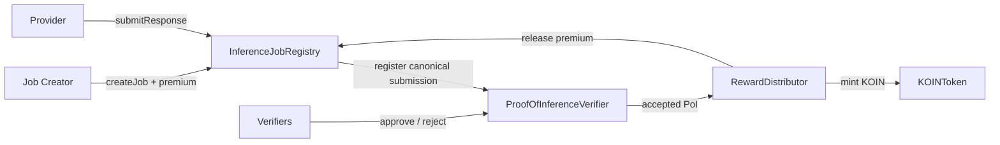

# Koinara v1 Architecture

## High-Level View

## Contract Boundaries

### Registry Layer

`InferenceJobRegistry` is the source of truth for job and submission lifecycle. It also escrows premium rewards so protocol issuance and market reward accounting stay separate.

### Verification Layer

`ProofOfInferenceVerifier` records minimum validity rather than quality ranking. It treats verifier quorum as the last MAI gate and produces PoI only after all minimum conditions pass.

### Reward Layer

`RewardDistributor` is the only mint path for `KOIN`. It computes emission by submission epoch, applies job weight, splits reward between provider and verifiers, and finalizes settlement.

### Token Layer

`KOINToken` is deliberately simple. It exposes a single minter role wired to `RewardDistributor`, and that role is configured once at deployment time.

## Why Separate Registry and Distributor

The premium reward is not protocol issuance. Separating escrow from minting keeps the accounting model explicit:

- registry handles native-token escrow and refunds
- distributor handles KOIN emission only
- token contract only tracks capped supply

## Ownerless Direction in v1

The reference implementation uses one-time admin wiring only for:

- setting the verifier address in the registry
- setting the reward distributor address in the registry
- setting the token minter

After wiring, the deployment flow renounces admin control.
