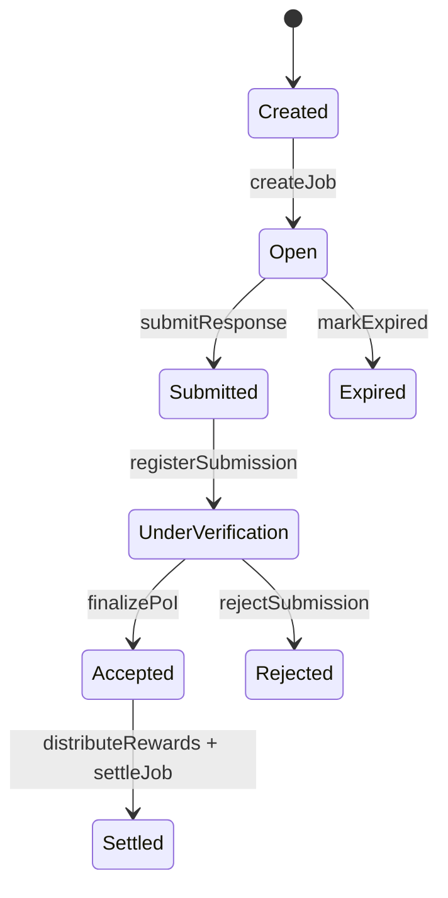

# Koinara Job State Machine

## Lifecycle

## Notes

- `Created` is a short-lived initialization state inside job creation
- newly created jobs immediately transition to `Open`
- only `Open` jobs can expire in v1
- accepted jobs settle only after reward distribution finishes
- rejected jobs do not mint KOIN
- expired jobs do not mint KOIN

## Invalid Transition Policy

The contracts reject invalid transitions with custom errors. This protects against:

- duplicate submissions
- premature verification
- duplicate settlement
- settlement of rejected jobs
- expiry of already submitted jobs
