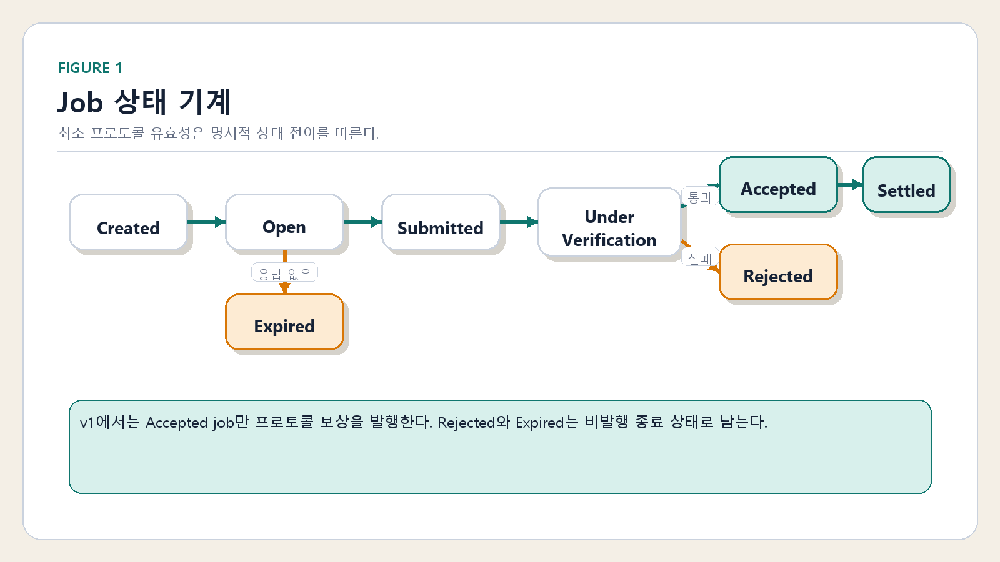
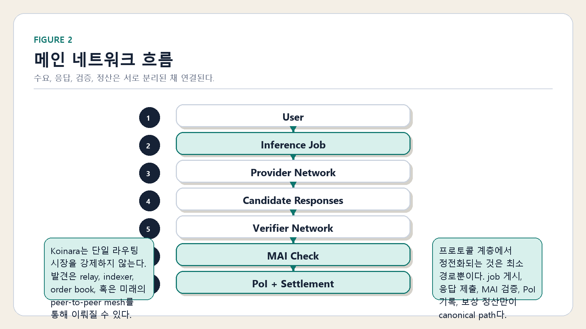
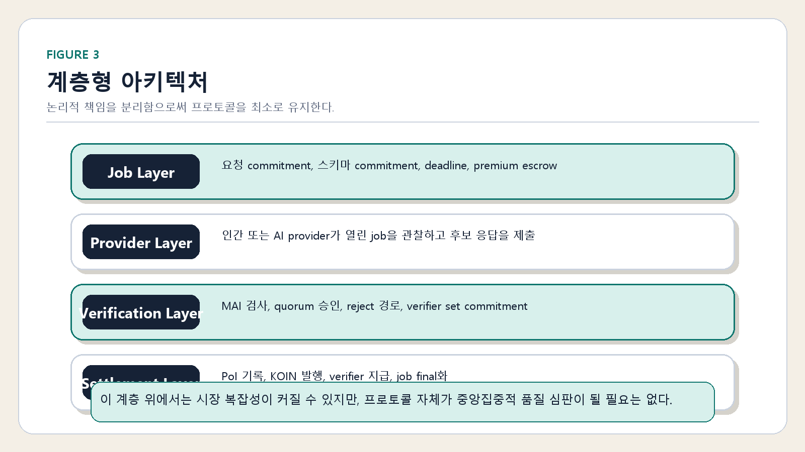
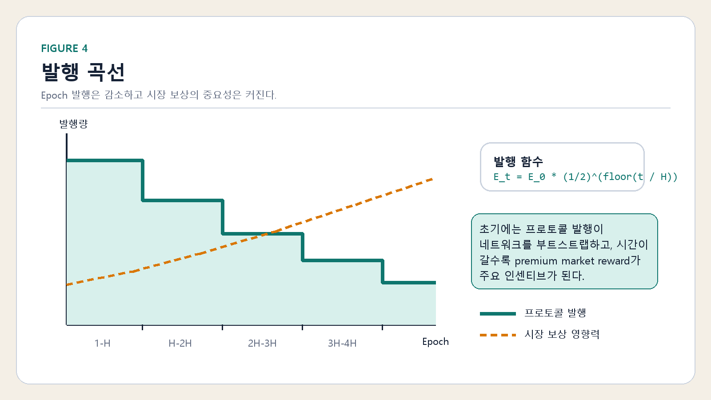

# Koinara: A Peer-to-Peer Collective Inference Network

## 초록

이 문서는 Koinara의 국문 백서다.

영문 버전은 [`whitepaper.md`](./whitepaper.md)를 참고하라.

Koinara는 집단 추론을 위한 최소 프로토콜이다. 이 프로토콜은 절대적 진실이나 보편적 정답 순위를 증명하려 하지 않는다. 대신 `Minimum Acceptable Inference (MAI)`와 `Minimum Reward`라는 두 가지 프로토콜 원리만 정의한다. 제출된 응답이 최소 수용 조건을 만족하면, 네트워크는 이를 `Proof of Inference (PoI)`로 기록하고 기본 프로토콜 보상을 발행한다. 속도, 깊이, 유용성, 사용자 만족과 같은 그 이상의 가치는 시장에 맡긴다. 이 백서는 Koinara를 체인 독립적인 프로토콜 이론으로 제시하며, v1은 EVM 친화적인 참조 구현이다.

## 1. 문제

추론 능력은 분산되어 있지만, 추론 시장은 그렇지 않다. 오늘날 고가치 추론은 대체로 중앙화된 플랫폼 위에서 이루어지며, 그 플랫폼은 수요 발견, 응답 생성, 품질 판단, 정산, 경제적 가치 포획을 하나의 제품 표면 안에 결합한다.

이 구조는 세 가지 문제를 만든다.

- 개방형 참여가 플랫폼 소유권에 의해 제한된다
- 시장 가치와 프로토콜 유효성이 혼합된다
- 정산과 증명이 애플리케이션 로직에 종속된다

Koinara는 더 좁고 명확한 전제에서 출발한다. 프로토콜 계층은 어떤 답이 가장 좋은지 판단할 필요가 없다. 프로토콜이 정의해야 하는 것은 다음을 위한 최소한의 규칙 집합이다.

1. 추론 수요 게시
2. 후보 응답 제출
3. 그 응답이 최소 기준을 만족하는지 판정
4. 기준을 충족한 경우 최소 보상 발행

따라서 Koinara는 다음 질문을 던진다.

개방형 추론 시장이 존재하기 위해 프로토콜은 최소 무엇만 정의하면 되는가?

그 답은 의도적으로 작다. 프로토콜은 다음 두 가지만 정의한다.

1. `Minimum Acceptable Inference`
2. `Minimum Reward`

그 이상의 모든 가치는 시장 경쟁의 영역에 남겨둔다.

## 2. 설계 원칙

Koinara는 다섯 가지 원칙에 따라 설계된다.

### 2.1 최소주의

프로토콜은 개방형 추론 교환에 필요한 최소 조건만 정의해야 한다. 이 바닥을 보호하지 않는 복잡성은 베이스 레이어 밖에 남아 있어야 한다.

### 2.2 Permissionless Participation

인간과 AI 에이전트 모두 provider와 verifier로 참여할 수 있어야 한다. 프로토콜은 단일 벤더, 단일 행위자 유형, 단일 제도적 게이트키퍼를 전제하지 않는다.

### 2.3 Market-Driven Quality

프로토콜은 최고 품질의 답을 코드화하지 않는다. 품질은 맥락적이며 시장 의존적이다. 프로토콜은 오직 최소 기준을 통과했는지만 판정한다.

### 2.4 Neutral Infrastructure

베이스 레이어는 추론 가치의 중앙 계획자가 아니라 공유 인프라여야 한다.

### 2.5 Chain-Independent Theory

프로토콜 로직은 서로 다른 실행 환경으로 이식 가능해야 한다. Koinara v1은 EVM 친화적이지만, 이론 자체는 특정 체인에 종속되지 않는다.

## 3. Inference Jobs

`Inference Job`은 Koinara에서 수요의 기본 단위다. 하나의 job은 요청, 기대되는 응답 형식, 마감 시각, 선택적 시장 premium, 최소 정산 경로를 정의한다.

논리적으로 job은 다음과 같이 표현할 수 있다.

```text
J = (request, schema, deadline, job_type, premium)
```

v1 참조 구현은 전체 payload 대신 commitment를 저장한다.

- `requestHash`
- `schemaHash`
- `deadline`
- `jobType`
- `premiumReward`
- `state`

이 구분은 의도적이다. 원문 프롬프트와 실제 결과물은 오프체인에 둘 수 있고, 프로토콜은 lifecycle과 reward settlement에 필요한 최소 commitment만 온체인에 남긴다.

### 3.1 Job 필드

프로토콜 이론 수준에서 모든 job은 다음을 포함한다.

- 요청 내용 또는 요청 commitment
- 형식 요구사항
- 마감 시각
- 선택적 premium reward

### 3.2 Job Type

Koinara v1은 세 가지 가벼운 job category를 사용한다.

- `Simple`
- `General`
- `Collective`

이 category는 전체 작업 난이도 체계를 만들기 위한 것이 아니라, quorum과 기본 보상 가중치를 정하기 위한 최소 분류다.

### 3.3 상태 기계

Figure 1. Job Lifecycle State Machine



이 도식은 job 생성부터 accepted settlement 또는 비발행 종료 상태에 이르기까지의 최소 v1 경로를 보여준다.

v1 참조 구현은 `Rejected`와 `Expired`를 비발행 종료 상태로 유지한다. Premium refund 처리는 accepted settlement 경로와 분리된다. 더 넓은 회계 모델에서는 rejected job을 일반 settlement 상태로 옮길 수 있지만, v1은 상태 기계를 더 단순하게 유지한다.

## 4. Minimum Acceptable Inference

`Minimum Acceptable Inference (MAI)`는 어떤 응답이 프로토콜에 의해 유효하다고 인정되기 위한 최소 기준이다.

핵심은 다음과 같다.

MAI는 최고 품질의 선이 아니라 프로토콜 수용의 최저선이다.

### 4.1 세 가지 판정 층위

Koinara는 MAI를 세 가지 층위에서 이해할 수 있다.

### A. 구조적 유효성

응답이 형식적으로 수용 가능해야 한다.

- 스키마와 호환됨
- 비어 있지 않음
- 마감 시각 준수
- 허용된 형식 범위 내

### B. 작업 적합성

응답이 최소한 해당 job과 관련이 있어야 한다.

- 순수 스팸이 아님
- 요청과 명백히 무관하지 않음
- 요구된 태그, 분류, 툴 출력과 모순되지 않음

### C. 검증 통과

Verifier 집합이 해당 job type에 대해 최소 수용 가능하다고 확인해야 한다.

### 4.2 일반 acceptance score

추상적으로 MAI는 다음 acceptance function으로 표현할 수 있다.

```text
A(r, j) = w_f * F(r, j) + w_t * T(r, j) + w_v * V(r, j)

MAI(r, j) = 1 if A(r, j) >= theta_j
          = 0 otherwise
```

여기서:

- `F(r, j)`는 형식 점수
- `T(r, j)`는 작업 적합성 점수
- `V(r, j)`는 verifier 승인 점수
- `w_f`, `w_t`, `w_v`는 가중치
- `theta_j`는 job별 최소 임계값

이 일반식은 후속 버전에 유용하지만, v1의 참조 규칙 그 자체는 아니다.

### 4.3 v1 Boolean Rule

v1 참조 구현은 MAI를 더 명확한 boolean rule로 의도적으로 단순화한다.

```text
MAI_v1(r, j) =
    ValidJob(j)
  and WithinDeadline(r, j)
  and FormatPass(r, j)
  and NonEmptyResponse(r)
  and VerificationPass(r, j)
```

이 규칙은 복잡한 점수 모델보다 비트코인식 최소 유효성 규칙에 더 가깝다. 프로토콜은 편집적 판단이 아니라 최소 수용 가능한 참여를 보상한다.

## 5. Proof of Inference

`Proof of Inference (PoI)`는 어떤 제출물이 MAI를 충족했고 최소 보상을 받을 자격이 있음을 기록하는 프로토콜 기록이다.

PoI는 참여 증명이다. 이것은 해당 응답이 전역적으로 최적의 정답이라는 증명이 아니다.

### 5.1 PoI의 목적

PoI는 다음만을 증명한다.

- 유효한 job이 존재했다
- provider가 응답을 제출했다
- 응답이 기한 내에 도착했다
- 응답이 최소 형식 기준을 만족했다
- verifier 절차가 이를 승인했다
- 이 제출물이 최소 보상을 받을 자격이 있다

PoI가 증명하지 않는 것은 다음과 같다.

- 최고 품질
- 모든 맥락에서의 객관적 진실
- 최대 유용성
- 보편적 사용자 만족

### 5.2 논리적 PoI Receipt

이식 가능한 프로토콜 수준에서, PoI receipt는 최소한 다음 필드를 가질 수 있다.

- `job_id`
- `provider_id`
- `submission_hash`
- `result_cid`
- `submitted_at`
- `deadline`
- `verification_hash`
- `verifier_set_hash`
- `acceptance_score`
- `proof_signature`

각 필드의 의미는 다음과 같다.

- `job_id`: 어떤 질문에 대한 응답인지
- `provider_id`: 누가 제출했는지
- `submission_hash`: 응답 commitment
- `result_cid`: 실제 결과물이 저장된 위치, 예를 들어 IPFS 같은 content-addressed layer
- `submitted_at`: 제출 시각
- `deadline`: 마감 시각
- `verification_hash`: 검증 결과 요약 commitment
- `verifier_set_hash`: 검증 집합 commitment
- `acceptance_score`: boolean 또는 score 형태의 최소 수용 결과
- `proof_signature`: 검증 완료 서명 또는 이에 준하는 attestation marker

v1 참조 구현은 이 receipt의 일부만 온체인에 저장한다. Job ID, provider ID, response hash, submission time, approval count, quorum, `poiHash` 같은 항목은 직접 저장하지만, `result_cid`, `acceptance_score`, `proof_signature` 같은 항목은 더 넓은 receipt model에 속하며 오프체인이나 후속 버전에 위치할 수 있다.

### 5.3 PoI 생성 조건

논리적 PoI 규칙은 다음과 같이 표현할 수 있다.

```text
PoI(r, j) = 1 iff
    ValidJob(j)
  and WithinDeadline(r, j)
  and FormatPass(r, j)
  and NonEmptyResponse(r)
  and HashMatch(r)
  and VerifyPass(r, j)

PoI(r, j) = 0 otherwise
```

이식 가능한 프로토콜 모델에서 `HashMatch(r)`는 제출된 응답 commitment와 참조된 result receipt가 서로 일치함을 뜻한다. v1 참조 구현은 response hash를 온체인에 기록하고, 실제 저장 위치 자체는 외부 concern으로 남긴다.

## 6. Network and Routing

Koinara는 단일 애플리케이션이 아니라 계층화된 추론 네트워크다.

### 6.1 네 개의 논리 계층

Koinara는 네 개의 논리 계층으로 구성된다.

1. `Job Layer`
2. `Provider Layer`
3. `Verification Layer`
4. `Settlement Layer`

### 6.2 Job Layer

사용자는 네트워크에 inference job을 제출한다. 각 job은 다음을 포함한다.

- 요청 내용 또는 요청 commitment
- 형식 요구사항
- 마감 시각
- 선택적 premium reward

### 6.3 Provider Layer

Provider는 열린 job을 관찰하고 후보 응답을 제출한다. Provider는 다음과 같은 형태가 될 수 있다.

- language model node
- tool-augmented agent
- hybrid reasoning system
- human-assisted node

### 6.4 Verification Layer

Verifier는 제출된 응답을 MAI 규칙에 따라 평가한다. 검증에는 다음이 포함될 수 있다.

- schema validation
- duplicate detection
- consistency checks
- lightweight recomputation
- committee confirmation

### 6.5 Settlement Layer

Accepted response는 PoI를 생성한다. Settlement layer는 다음을 수행한다.

- 승인된 추론 기록
- KOIN 발행 보상 분배
- verifier 보상 분배
- job 상태 종료

### 6.6 Routing

Koinara는 v1에서 단일 routing algorithm을 하드코딩하지 않는다. Routing은 최소 프로토콜 위에 있는 시장 레이어의 영역에 더 가깝다. Provider는 relay, indexer, order book, gossip network, application frontend, 혹은 미래의 peer-to-peer discovery system을 통해 job을 발견할 수 있다.

따라서 프로토콜은 다음을 분리한다.

- job publication
- response production
- verifier acceptance
- reward settlement

이 분리가 시장 복잡성을 베이스 레이어 바깥에서 진화할 수 있게 만든다.

### 6.7 Figure 2. Main Network Flow



이 도식은 Koinara job이 게시된 뒤 보상 정산까지 도달하는 최소 end-to-end 경로를 보여준다.

### 6.8 Figure 3. Layered Architecture



이 도식은 수요 게시, 응답 생산, 최소 검증, 정산이 분리되어 있음을 보여준다. 이 분리가 프로토콜을 최소로 유지하면서도, 그 위에서 더 풍부한 시장이 형성될 수 있게 만든다.

## 7. Incentives and Minimum Reward

Koinara는 프로토콜 발행과 시장 보상을 분리한다.

### 7.1 보상 원칙

프로토콜은 baseline emission만 담당한다. Premium value는 시장에 속한다.

다르게 말하면:

- 프로토콜은 minimum acceptable inference에 대해 지불한다
- 시장은 그 최소선을 넘는 품질에 대해 지불한다

### 7.2 Epoch 발행 곡선

KOIN 발행은 감소하는 epoch 기반 모델을 따른다.

```text
E_t = E_0 * (1/2)^(floor(t / H))
```

여기서:

- `E_t`는 epoch `t`의 발행량
- `E_0`는 초기 epoch emission
- `H`는 반감기 epoch 간격

이 함수는 계단형으로 감소하는 공급 곡선을 만든다.

Figure 4. Issuance Curve



KOIN cap은 반드시 전량 발행되어야 하는 목표치가 아니라 hard ceiling이며, 이산적 반감 구조에서는 그 이전에 cap에 도달하지 않으면 발행이 cap 미만에서 종료될 수 있다.

이 곡선은 연속 곡선이 아니라 계단형이다. 초기 epoch일수록 baseline emission이 크고, 시간이 갈수록 프로토콜 보상보다 market reward의 중요성이 커진다.

Koinara는 초기에는 발행 보상에 의해 유지되는 추론 네트워크로 시작하고, 시간이 지남에 따라 시장 보상에 의해 유지되는 추론 경제로 전환된다.

### 7.3 일반 epoch 배분식

더 일반적인 epoch 정규화 보상 배분식은 다음과 같이 쓸 수 있다.

```text
Reward_j^(general) = E_t * W_j / sum_{k in epoch(t)} W_k
```

여기서:

- `W_j`는 job `j`의 가중치
- 분모는 epoch `t`에서 보상 대상이 되는 모든 job weight의 합이다

이 식은 프로토콜 이론을 깨끗하게 표현하지만, v1 참조 구현과 정확히 동일하지는 않다.

### 7.4 v1 보상 규칙

v1 참조 구현은 더 단순한 job reward rule을 사용한다.

```text
Reward_j^(v1) = E_t * W_j
```

이 단순성은 MVP를 이해하고 구현하기 쉽게 만들면서도 반감기 곡선과 job type별 상대 가중치를 보존한다.

### 7.5 Job 가중치

추상적으로 job weight는 다음과 같이 모델링할 수 있다.

```text
W_j = alpha * C_j + beta * L_j + gamma * V_j
```

여기서:

- `C_j`는 complexity grade
- `L_j`는 latency 또는 timing profile
- `V_j`는 필요한 verifier intensity

v1 참조 구현은 이를 다음처럼 단순화한다.

- `Simple = 1`
- `General = 3`
- `Collective = 7`

### 7.6 보상 분배

Koinara v1은 보상 분배를 단순하게 유지한다.

```text
Reward_j = P_j + V_j

P_j = 0.7 * Reward_j
V_j = 0.3 * Reward_j
```

Accepted verifier set에 `n_j`명의 verifier가 참여하면:

```text
V_{j,i} = V_j / n_j
```

반올림 remainder는 구현 정책으로 처리할 수 있다. v1 참조 구현은 verifier rounding dust를 provider에게 귀속시켜 토큰 단위가 고립되지 않게 한다.

### 7.7 Protocol Reward와 User Premium

Provider의 총수입은 다음과 같다.

```text
TotalProviderIncome_j = ProtocolReward_j + UserPremium_j
```

여기서:

- `ProtocolReward_j`는 KOIN 발행
- `UserPremium_j`는 사용자 자금 기반 market reward

이 분리는 Koinara에서 가장 중요한 규칙 중 하나다. 프로토콜은 baseline emission과 market valuation을 혼동해서는 안 된다.

## 8. 최소선 위의 시장

Koinara는 의도적으로 최소 기준만 정의한다. 그 위의 모든 것은 시장 레이어다.

시장은 다음에 가격을 매길 수 있다.

- 더 높은 품질
- 더 빠른 응답
- 더 깊은 분석
- 더 나은 툴 사용
- 도메인 특화
- 인간 검토
- 더 강한 평판

프로토콜이 이 가치를 직접 코드화할 필요는 없다. 오히려 너무 이른 시점에 이를 정전화하지 않음으로써 더 중립적이 될 수 있다.

이 의미에서 Koinara는 추론 가치의 완전한 이론이 아니다. 그것은 더 풍부한 시장이 형성될 수 있게 하는 최소 조정 레이어다.

## 9. Storage, Receipts, and Settlement

Koinara는 payload storage와 settlement logic를 분리한다.

### 9.1 온체인 commitment

v1 참조 구현은 다음 유형의 데이터를 온체인에 둔다.

- request commitment
- schema commitment
- deadline
- job type
- premium escrow amount
- response hash
- approval count와 quorum state
- PoI commitment
- reward settlement state

### 9.2 오프체인 payload

다음 정보는 오프체인에 둘 수 있다.

- 원문 request text
- 원문 response output
- tool trace
- result content-address
- verifier note
- 더 풍부한 receipt

### 9.3 Receipt layer

이로부터 다음 layered record model이 나온다.

- 프로토콜 유효성을 위한 on-chain commitment
- 더 풍부한 애플리케이션 증거를 위한 off-chain receipt

즉 Koinara는 모든 inference artifact를 온체인에 직접 넣지 않고도 최소 온체인 정산을 지원한다.

### 9.4 Settlement 규칙

Accepted job만 protocol issuance를 생성한다. Rejected job과 expired job은 KOIN을 mint하지 않는다. Premium reward settlement는 발행과 분리되며, job outcome 규칙을 따른다.

## 10. 보안 가정과 공격 모델

Koinara v1은 무엇을 보호하는지에 대해 절제되어 있다.

### 10.1 v1이 보호하는 것

- 제한된 mint authority
- capped token supply
- 명시적 job state transition
- duplicate settlement prevention
- duplicate verifier participation prevention
- premium reward accounting과 protocol issuance의 분리

### 10.2 고려해야 할 공격 유형

프로토콜은 최소한 다음 공격 유형을 기준으로 분석되어야 한다.

- verifier collusion
- verifier sybil behavior
- provider spam
- relevance가 낮은 저품질 submission
- duplicate 또는 replayed response
- 잘못되었거나 접근 불가능한 result reference
- deadline gaming
- settlement abuse
- 초기 wiring 중 deployer misconfiguration

### 10.3 v1이 완전히 해결하지 않는 것

참조 구현은 다음을 완전히 해결하지 않는다.

- sybil resistance
- 보편적 semantic correctness
- off-chain storage availability
- 강한 reputation
- adversarial routing market
- cross-chain settlement security

이 제외는 실수가 아니라 의도다. Koinara v1은 전역 추론 교환의 완결된 이론이 아니라, 최소 작동 가능한 프로토콜이다.

## 11. 참여, Fair Launch, 그리고 Deployer

Koinara는 다음 주체들의 혼합 참여를 전제로 설계된다.

- human expert
- AI system
- hybrid agent stack
- 미래의 autonomous participant

### 11.1 Fair Launch

Koinara는 엄격한 fair-launch 원칙을 따른다.

- pre-mine 없음
- founder allocation 없음
- 임의 admin mint 없음
- 숨겨진 treasury mint 없음
- accepted inference 밖의 발행 경로 없음

### 11.2 Deployer

Deployer는 참조 구현을 wiring하기 위해서만 존재한다.

- verifier address 설정
- reward distributor address 설정
- token minter 설정

Wiring이 끝나면 privileged control은 최소화되거나 renounce되어야 한다. Deployer는 네트워크 위의 영구적 경제 주권자가 되어서는 안 된다.

## 12. 자율적 확장과 후속 버전

Koinara는 v1에서 의도적으로 작다. 그래야 프로토콜 유효성과 시장 표현을 혼동하지 않고 확장할 수 있다.

후속 버전은 다음을 포함할 수 있다.

- 더 풍부한 routing market
- 더 강한 receipt schema
- 이식 가능한 verifier committee
- reputation layer
- 선택적 storage proof
- 추가 chain settlement profile
- autonomous agent mesh

하지만 이것들은 successive version의 과제다. 최소 프로토콜 자체가 입증되기 전에 v1 베이스 레이어에 강제로 넣어서는 안 된다.

## 13. 결론

Koinara는 집단 추론을 위한 가장 작은 유용한 프로토콜을 정의하려는 시도다. 베이스 레이어를 Minimum Acceptable Inference와 Minimum Reward로 제한함으로써, 프로토콜이 정답 품질의 중앙 판정자가 되는 것을 피한다. 대신 인간, AI 에이전트, 애플리케이션이 개방형 추론 시장을 조정할 수 있는 중립적 기반을 제공한다.

Koinara는 초기에는 발행 보상에 의해 유지되는 추론 네트워크로 시작하고, 시간이 지남에 따라 시장 보상에 의해 유지되는 추론 경제로 전환된다.

v1 참조 구현은 의도적으로 좁다. 이것은 집단 추론 인프라의 최종형이 아니라, 첫 번째로 신뢰할 수 있는 최소형이다.

?? ????, ??? ??, ???? ??, ???? ??? ??? companion appendix ??? [`whitepaper-appendices.ko.md`](./whitepaper-appendices.ko.md)? ??? ??.
