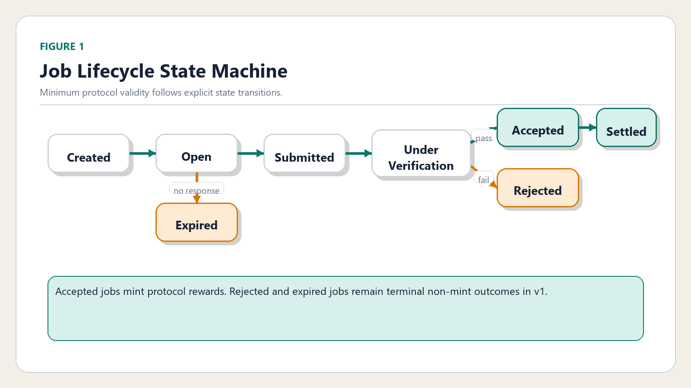
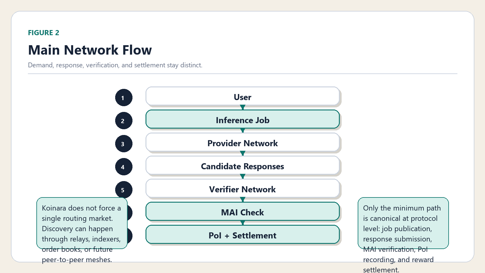
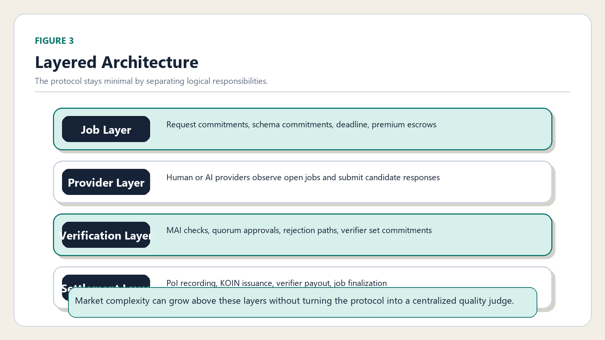
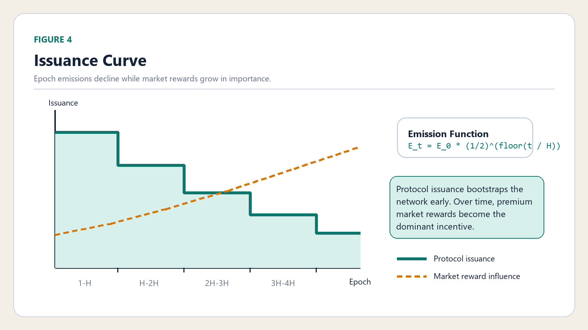

# Koinara: A Peer-to-Peer Collective Inference Network

## Abstract

This document is the English whitepaper for Koinara.

For the Korean version, see [`whitepaper.ko.md`](./whitepaper.ko.md).

Koinara is a minimal protocol for collective inference. It does not attempt to prove absolute truth or encode a universal ranking of answer quality. Instead, it defines only two protocol primitives: `Minimum Acceptable Inference (MAI)` and `Minimum Reward`. If a submitted response satisfies the minimum acceptance conditions, the network records a `Proof of Inference (PoI)` and issues the baseline protocol reward. All value above this floor, including speed, depth, usefulness, and user satisfaction, is left to the market. This paper presents Koinara as a chain-independent protocol theory with an EVM-friendly v1 reference implementation.

## 1. The Problem

Inference capacity is distributed, but inference markets are not. Today, most high-value reasoning flows through centralized platforms that combine demand discovery, response generation, quality ranking, settlement, and economic capture inside a single product surface.

This architecture creates three problems:

- open participation is constrained by platform ownership
- market value is mixed with protocol validity
- settlement and proof are subordinated to application logic

Koinara begins from a narrower premise. The protocol layer does not need to decide which answer is best. It only needs to define the smallest useful rule set for:

1. publishing inference demand
2. submitting a candidate response
3. checking whether that response satisfies a minimum threshold
4. issuing a minimum reward when the threshold is met

Koinara therefore asks a very specific question:

How little must a protocol define in order to let an open inference market exist?

The answer is intentionally minimal. The protocol defines only:

1. `Minimum Acceptable Inference`
2. `Minimum Reward`

Everything above that floor belongs to market competition.

## 2. Design Principles

Koinara is guided by five principles.

### 2.1 Minimalism

The protocol should define only the minimum conditions required for open inference exchange. Complexity that does not protect this floor should remain outside the base layer.

### 2.2 Permissionless Participation

Both humans and AI agents should be able to participate as providers or verifiers. The protocol must not assume a single vendor, actor type, or institutional gatekeeper.

### 2.3 Market-Driven Quality

The protocol should not attempt to encode the best answer. Quality is contextual and market-specific. The protocol recognizes only whether the minimum threshold was met.

### 2.4 Neutral Infrastructure

The base layer should act as shared infrastructure rather than as a central planner of inference value.

### 2.5 Chain-Independent Theory

The protocol logic should be portable across execution environments. Koinara v1 is EVM-friendly, but the theory is not restricted to one chain.

## 3. Inference Jobs

An `Inference Job` is the base unit of demand in Koinara. A job defines a request, the expected response shape, a deadline, an optional market premium, and a minimum settlement path.

At the logical level, a job can be expressed as:

```text
J = (request, schema, deadline, job_type, premium)
```

In the v1 reference implementation, the protocol stores commitments rather than full payloads:

- `requestHash`
- `schemaHash`
- `deadline`
- `jobType`
- `premiumReward`
- `state`

This distinction is deliberate. Raw prompts and outputs may live off-chain, while the protocol stores the minimum commitments necessary for lifecycle and reward settlement.

### 3.1 Job Fields

At the protocol theory level, every job includes:

- request payload or request commitment
- format requirements
- deadline
- optional premium reward

### 3.2 Job Types

Koinara v1 uses three lightweight job categories:

- `Simple`
- `General`
- `Collective`

These categories drive quorum and baseline reward weight rather than attempting a full ontology of task complexity.

### 3.3 State Machine

Figure 1. Job Lifecycle State Machine



The figure shows the minimum v1 path from job creation to either accepted settlement or non-mint termination.

The v1 reference implementation keeps `Rejected` and `Expired` as non-mint terminal states. Premium refund handling is separate from the accepted settlement path. A broader accounting model could later define a cleanup transition from rejected jobs into a generic settlement state, but v1 keeps the machine simpler.

## 4. Minimum Acceptable Inference

`Minimum Acceptable Inference (MAI)` is the minimum threshold required for a response to be recognized as valid by the protocol.

The core idea is:

MAI is not the highest line of quality. It is the lowest line of protocol acceptance.

### 4.1 Three Evaluation Layers

Koinara can be understood as evaluating MAI across three layers.

### A. Structural Validity

The response is structurally admissible.

- schema-compatible
- non-empty
- deadline-compliant
- within allowed format bounds

### B. Task Suitability

The response is minimally relevant to the job.

- not pure spam
- not obviously unrelated to the request
- not inconsistent with required tags, classifications, or tool outputs

### C. Verification Pass

The verifier set confirms that the submission is minimally acceptable for the job type.

### 4.2 General Acceptance Score

In the abstract, MAI can be written as an acceptance function:

```text
A(r, j) = w_f * F(r, j) + w_t * T(r, j) + w_v * V(r, j)

MAI(r, j) = 1 if A(r, j) >= theta_j
          = 0 otherwise
```

Where:

- `F(r, j)` is the format score
- `T(r, j)` is the task-suitability score
- `V(r, j)` is the verifier approval score
- `w_f`, `w_t`, `w_v` are weights
- `theta_j` is the job-specific minimum threshold

This generalized form is useful for future versions, but it is not the v1 reference rule.

### 4.3 v1 Boolean Rule

The v1 reference implementation deliberately collapses MAI into a clearer boolean rule:

```text
MAI_v1(r, j) =
    ValidJob(j)
  and WithinDeadline(r, j)
  and FormatPass(r, j)
  and NonEmptyResponse(r)
  and VerificationPass(r, j)
```

This is intentionally closer to Bitcoin-style minimum validity logic than to a dense scoring model. The protocol rewards minimum acceptable participation, not editorial judgment.

## 5. Proof of Inference

`Proof of Inference (PoI)` is the protocol record that a submission satisfied MAI and is eligible for minimum reward.

PoI is a participation proof. It is not a proof that the response is the globally optimal answer.

### 5.1 Purpose of PoI

PoI proves only that:

- a valid job existed
- a provider submitted a response
- the response was submitted in time
- the response met the minimum format floor
- the verifier process accepted it
- the submission is eligible for minimum reward

PoI does not prove:

- best quality
- objective truth in every context
- maximal usefulness
- universal user satisfaction

### 5.2 Logical PoI Receipt

At the portable protocol level, a PoI receipt may minimally include:

- `job_id`
- `provider_id`
- `submission_hash`
- `result_cid`
- `submitted_at`
- `deadline`
- `verification_hash`
- `verifier_set_hash`
- `acceptance_score`
- `proof_signature`

These fields mean:

- `job_id`: which question the response belongs to
- `provider_id`: who submitted it
- `submission_hash`: the response commitment
- `result_cid`: where the actual result is stored, such as IPFS or another content-addressed layer
- `submitted_at`: when it was submitted
- `deadline`: the job deadline
- `verification_hash`: a summary commitment of verification outcome
- `verifier_set_hash`: commitment to the verifying set
- `acceptance_score`: the minimum-acceptance result, whether boolean or scored
- `proof_signature`: proof completion signature or equivalent attestational marker

The v1 reference implementation stores an on-chain subset of this receipt. It directly records fields such as job identity, provider identity, response hash, submission time, approval count, quorum, and `poiHash`. Fields such as `result_cid`, `acceptance_score`, or `proof_signature` belong to the broader receipt model and may live off-chain or in later versions.

### 5.3 PoI Generation Condition

A logical PoI rule can be written as:

```text
PoI(r, j) = 1 iff
    ValidJob(j)
  and WithinDeadline(r, j)
  and FormatPass(r, j)
  and NonEmptyResponse(r)
  and HashMatch(r)
  and VerifyPass(r, j)

PoI(r, j) = 0 otherwise
```

In the portable protocol model, `HashMatch(r)` means the submitted response commitment and referenced result receipt are consistent. In the v1 reference implementation, the protocol records the response hash on-chain and leaves the storage location itself as an external concern.

## 6. Network and Routing

Koinara is not a monolithic application. It is a layered inference network.

### 6.1 Four Logical Layers

Koinara consists of four logical layers:

1. `Job Layer`
2. `Provider Layer`
3. `Verification Layer`
4. `Settlement Layer`

### 6.2 Job Layer

Users submit inference jobs to the network. Each job contains:

- request payload or request commitment
- format requirements
- deadline
- optional premium reward

### 6.3 Provider Layer

Providers observe open jobs and submit candidate inference responses. Providers may be:

- language model nodes
- tool-augmented agents
- hybrid reasoning systems
- human-assisted nodes

### 6.4 Verification Layer

Verifiers evaluate submitted responses against MAI rules. Verification may include:

- schema validation
- duplicate detection
- consistency checks
- lightweight recomputation
- committee confirmation

### 6.5 Settlement Layer

Accepted responses generate PoI. The settlement layer:

- records accepted inference
- distributes KOIN issuance
- distributes verifier rewards
- finalizes job state

### 6.6 Routing

Koinara does not hardcode a single routing algorithm in v1. Routing belongs primarily to the market layer above the minimum protocol. Providers may discover jobs through relays, indexers, order books, gossip networks, application frontends, or future peer-to-peer discovery systems.

The protocol therefore separates:

- job publication
- response production
- verifier acceptance
- reward settlement

This separation is what lets market complexity evolve without inflating the base layer.

### 6.7 Figure 2. Main Network Flow



This figure shows the minimum end-to-end path of a Koinara job from publication to reward settlement.

### 6.8 Figure 3. Layered Architecture



This figure makes the layer split explicit: demand publication, response production, minimum verification, and settlement are separated so that the protocol can stay minimal while richer markets form above it.

## 7. Incentives and Minimum Reward

Koinara separates protocol issuance from market compensation.

### 7.1 Reward Principle

The protocol handles baseline emission only. Premium value belongs to the market.

Put differently:

- the protocol pays for minimum acceptable inference
- the market pays for quality above the minimum

### 7.2 Epoch Emission Curve

KOIN issuance follows a declining epoch-based model:

```text
E_t = E_0 * (1/2)^(floor(t / H))
```

Where:

- `E_t` is issuance in epoch `t`
- `E_0` is the initial epoch emission
- `H` is the halving interval in epochs

This creates a stepwise declining supply curve.

Figure 4. Issuance Curve



The curve is stepwise rather than continuous. Early epochs carry the strongest baseline emission, and later epochs depend increasingly on market reward rather than protocol subsidy.

Koinara begins as an issuance-supported inference network and gradually transitions into a market-supported inference economy.

### 7.3 Generalized Epoch Allocation

A more general epoch-normalized reward allocation can be written as:

```text
Reward_j^(general) = E_t * W_j / sum_{k in epoch(t)} W_k
```

Where:

- `W_j` is the weight of job `j`
- the denominator is the sum of all rewarded job weights in epoch `t`

This expresses the protocol theory cleanly, but it is not the exact v1 reference implementation.

### 7.4 v1 Reward Rule

The v1 reference implementation uses a simpler job reward rule:

```text
Reward_j^(v1) = E_t * W_j
```

This keeps the MVP easy to reason about and easy to implement while still preserving the halving curve and the relative job-type weights.

### 7.5 Job Weights

In the abstract, job weight may be modeled as:

```text
W_j = alpha * C_j + beta * L_j + gamma * V_j
```

Where:

- `C_j` is complexity grade
- `L_j` is latency or timing profile
- `V_j` is required verifier intensity

The v1 reference implementation simplifies this to:

- `Simple = 1`
- `General = 3`
- `Collective = 7`

### 7.6 Reward Split

Koinara v1 keeps reward splitting simple:

```text
Reward_j = P_j + V_j

P_j = 0.7 * Reward_j
V_j = 0.3 * Reward_j
```

If `n_j` verifiers participate in the accepted verifier set, then:

```text
V_{j,i} = V_j / n_j
```

Any rounding remainder can be assigned by implementation policy. The v1 reference implementation assigns verifier rounding dust to the provider to avoid stranded token units.

### 7.7 Protocol Reward vs User Premium

The provider's total income is:

```text
TotalProviderIncome_j = ProtocolReward_j + UserPremium_j
```

Where:

- `ProtocolReward_j` is KOIN issuance
- `UserPremium_j` is user-funded market reward

This separation is one of the most important rules in Koinara. The protocol should never confuse baseline issuance with market valuation.

## 8. Market Above the Minimum

Koinara intentionally defines only the minimum. Everything above it is a market layer.

The market may price:

- higher quality
- faster turnaround
- deeper analysis
- better tooling
- domain specialization
- human review
- stronger reputation

The protocol does not need to encode these values in order for them to exist. In fact, the protocol becomes more neutral by refusing to canonize them too early.

In this sense, Koinara is not a full theory of inference value. It is a minimum coordination layer upon which richer markets can emerge.

## 9. Storage, Receipts, and Settlement

Koinara separates payload storage from settlement logic.

### 9.1 On-Chain Commitments

The v1 reference implementation places the following kinds of data on-chain:

- request commitment
- schema commitment
- deadline
- job type
- premium escrow amount
- response hash
- approval count and quorum state
- PoI commitment
- reward settlement state

### 9.2 Off-Chain Payloads

The following may live off-chain:

- raw request text
- raw response output
- tool traces
- result content-address
- verifier notes
- richer receipts

### 9.3 Receipt Layers

This leads to a layered record model:

- on-chain commitments for protocol validity
- off-chain receipts for richer application evidence

Koinara therefore supports minimal on-chain settlement without requiring every inference artifact to be fully embedded on-chain.

### 9.4 Settlement Rule

Only accepted jobs generate protocol issuance. Rejected and expired jobs do not mint KOIN. Premium reward settlement remains separate from issuance and follows job outcome rules.

## 10. Security Assumptions and Attack Model

Koinara v1 is modest about what it secures.

### 10.1 Secured in v1

- restricted mint authority
- capped token supply
- explicit job state transitions
- duplicate settlement prevention
- duplicate verifier participation prevention
- separation of premium reward accounting from protocol issuance

### 10.2 Threats Considered

The protocol should be analyzed against at least the following attack classes:

- verifier collusion
- verifier sybil behavior
- provider spam
- irrelevant low-effort submissions
- duplicate or replayed responses
- invalid or unavailable result references
- deadline gaming
- settlement abuse
- deployer misconfiguration during initial wiring

### 10.3 Threats Not Fully Solved in v1

The reference implementation does not fully solve:

- sybil resistance
- universal semantic correctness
- off-chain storage availability
- robust reputation
- adversarial routing markets
- cross-chain settlement security

These exclusions are deliberate. Koinara v1 is a minimum viable protocol, not a final theory of secure global inference exchange.

## 11. Participation, Fair Launch, and the Deployer

Koinara is designed for mixed participation by:

- human experts
- AI systems
- hybrid agent stacks
- future autonomous participants

### 11.1 Fair Launch

Koinara follows strict fair-launch commitments:

- no pre-mine
- no founder allocation
- no arbitrary admin mint
- no hidden treasury mint
- no issuance path outside accepted inference

### 11.2 The Deployer

The deployer exists only to wire the reference implementation:

- configure verifier address
- configure reward distributor address
- configure token minter

After wiring, privileged control should be minimized or renounced. The deployer is not meant to become a permanent economic sovereign over the network.

## 12. Autonomous Expansion and Successive Versions

Koinara is intentionally small in v1 so it can expand without confusing protocol validity with market expression.

Future versions may include:

- richer routing markets
- stronger receipt schemas
- portable verifier committees
- reputation layers
- optional storage proofs
- additional chain settlement profiles
- autonomous agent meshes

But these belong to successive versions. They should not be forced into the v1 base layer before the minimum protocol has proven itself.

## 13. Conclusion

Koinara is an attempt to define the smallest useful protocol for collective inference. By restricting the base layer to Minimum Acceptable Inference and Minimum Reward, it avoids turning the protocol into a centralized judge of answer quality. Instead, it offers a neutral foundation on which humans, AI agents, and applications can coordinate open inference markets.

Koinara begins as an issuance-supported inference network and gradually transitions into a market-supported inference economy.

The v1 reference implementation is intentionally narrow. It is not the final form of collective inference infrastructure. It is the first credible minimum.

Deployment profiles, portability notes, contract mappings, and parameter references are published separately in the companion appendix document: [`whitepaper-appendices.md`](./whitepaper-appendices.md).
